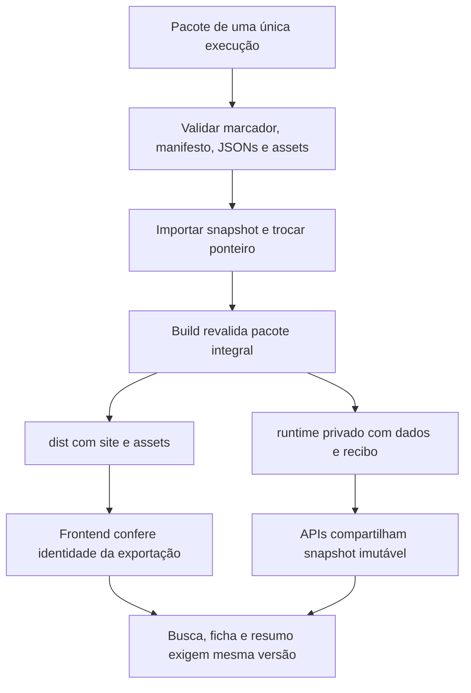

# Raio-X da migração do contrato eleitoral

## 1. Resultado da versão

A implementação local foi concluída e validada com **99 testes automatizados**, build do pacote real e teste integrado de sanidade. Não houve commit, deploy, alteração do notebook ou reescrita dos dados originais.

A inspeção encontrou uma migração parcial: já havia chaves completas e alguns tratamentos novos, mas ainda faltavam garantias de integridade, consistência entre fontes e segurança editorial dos resumos. A alteração não foi apenas renomear campos: o fluxo de importação, leitura, publicação e cache passou a usar uma versão verificável de ponta a ponta.

Conforme solicitado durante o trabalho, **`data/textos_propostas.json` foi mantido como nome canônico**. Ele contém a nova estrutura de documentos e páginas, não resumos antigos de IA. O manifesto disponível já registrava esse nome; não foi necessário alterar nenhum JSON exportado ou controle.

O pacote atual contém os 11 JSONs esperados com esse nome adotado. A validação integral dos arquivos e assets passou. Não foram criados dados fictícios para simular importação concluída; as fixtures de testes existem somente em ambientes temporários de teste.

## 2. Antes e depois

| Tema | Antes desta intervenção | Agora | Motivo |
| --- | --- | --- | --- |
| Integridade | O loader conferia o marcador, mas não os hashes de todos os arquivos | Importação/build validam marcador, manifesto, JSONs, assets e vínculos | Impedir ativação de pacote alterado, incompleto ou misturado |
| Leitura | Cache por arquivo com leitura direta de `data/` | Snapshot validado e congelado, fixo por processo | Impedir que uma ficha misture execuções |
| Publicação estática | Vercel publicava `public/`, que também continha arquivos históricos | Vercel publica somente `dist/`, gerado por lista explícita de arquivos | Não publicar legado/auditoria acidentalmente |
| Busca | Índice público podia permanecer separado da fonte do servidor | `/api/lista` usa o snapshot; índice estático é cópia gerada da mesma fonte | Evitar busca de uma versão com ficha de outra |
| Identidade | Adaptação canônica parcial, com validações insuficientes | Chave completa, validação estrita, aliases apenas quando inequívocos | Evitar associação com candidatura errada |
| Cache da ficha | Havia tentativa de reaproveitamento local de dados | Removido fallback offline de fichas; chamadas exigem versão | Não mostrar ficha antiga como atual após falha |
| Financeiro | Havia suporte parcial a centavos/estados | Formatação exata, conciliação BigInt e conjuntos/contagens separados | Não transformar ausência em zero nem multiplicar pagamentos |
| Extração | Existia caminho de fallback textual legado e tratamento limitado de PDFs | Única fonte nova, páginas selecionadas, vários PDFs e controles de cobertura | Não ignorar documentos ou duplicar texto nativo/OCR |
| Resumo | Saída textual livre, com risco de truncamento e suporte insuficiente | Afirmações tipadas, referências reais, blocos e cobertura validados | Preservar rastreabilidade e evitar conteúdo apresentado como completo sem ser |
| Revisão | Avisar que é IA não estabelecia uma aprovação editorial verificável | Rascunho e publicação são estados distintos; revisão exclusivamente offline | Não chamar geração automática de conteúdo revisado |
| Bundle de funções | Não havia separação suficiente para empacotar a nova validação | `runtime/` privado sem fotos/PDFs; assets em `dist/` | Evitar exceder o limite padrão serverless |
| Testes | Script de sanidade dependia de candidaturas e totais particulares | Suítes de contrato com fixtures e sanidade real sem identidade fixa | Testar riscos de migração sem amarrar o código à exportação de teste |

## 3. Arquivos existentes alterados

| Arquivo | Resumo e razão da alteração |
| --- | --- |
| `api/candidato.js` | Adapter explícito de identidade, versão solicitada, junções pela chave e respostas de erro seguras. Preserva os campos principais da resposta anterior. |
| `api/resumo.js` | Endpoint de consulta/rascunho estruturado, seleção de documentos, validação da versão e tratamento de falhas. Não aprova publicações remotamente. |
| `lib/jsonCache.js` | Compartilha fonte validada e imutável entre APIs, sem trocar a execução durante o processo. Expõe contratos internos para resumo e leitura segura. |
| `public/script.js` | Busca/ficha/resumo integrados à exportação; estados e dinheiro corretos; documentos com hash; seleção de PDFs; proteção contra respostas atrasadas e renderização de texto sem HTML do modelo. |
| `public/index.html` | Mantém a estrutura visual e acrescenta identidade da exportação, seleção/consulta de resumos, avisos e configuração da base pública. |
| `package.json` | Comandos de teste, importação, build e sanidade. Sem novas dependências de produção. |
| `vercel.json` | Saída pública passou a `dist/`; inclui somente runtime e resumos revisados nas funções, excluindo fontes e assets volumosos. |
| `.gitignore` | Ignora artefatos de build/runtime, locks e arquivos temporários. Não ignora automaticamente o histórico importado necessário ao build. |
| `tests_sanidade.mjs` | Verifica o pacote real e sua integração com os handlers e a saída pública, sem fixar candidato, data ou total de uma execução. |
| `README.md` | Substitui instruções desatualizadas por contrato, importação, operação, revisão e limitações reais. |

`public/style.css` não foi alterado. Foram reaproveitadas classes e a estrutura visual existentes, mas não houve comparação visual em navegador; isso permanece uma verificação recomendada antes de disponibilizar a versão ao público.

## 4. Novos arquivos e por que existem

| Arquivo | Responsabilidade |
| --- | --- |
| `api/lista.js` | Fornece busca/listagem a partir da mesma fonte validada das fichas. |
| `lib/apiDados.js` | Centraliza HTTP GET, cabeçalhos, validação de disponibilidade e seleção segura dos metadados públicos. |
| `lib/exportacao.js` | Define contrato importável, valida arquivos/hashes/identidades/dinheiro/vínculos e faz importação versionada. |
| `lib/runtimeSnapshot.js` | Gera/verifica o pacote privado de execução após o build integral, dispensando PDFs dentro das funções. |
| `lib/resumos.js` | Separa regras de extração, cobertura, cache, resposta estruturada e publicação das dependências HTTP/Gemini. Permite testes sem serviços externos. |
| `public/frontend-helpers.mjs` | Funções testáveis de dinheiro, identidade, assets, busca, seleção e controle de requisições. |
| `public/icons/candidato-placeholder.svg` | Placeholder neutro local para foto ausente, sem buscar uma foto por heurística. |
| `scripts/importar-exportacao.mjs` | Entrada de linha de comando para importar uma pasta completa validada. |
| `scripts/build.mjs` | Produz site e runtime coerentes, valida a cópia dos assets e gerencia staging/rollback. |
| `scripts/revisar-resumo.mjs` | Aprovação humana offline com confirmações explícitas e artefato vinculado ao conteúdo/versão. |
| `tests/exportacao.test.mjs` | Importação, integridade, centavos, aliases, extração pendente, runtime e rollback. |
| `tests/api.test.mjs` | Contratos HTTP, versões, identidade e preservação dos dados. |
| `tests/frontend.test.mjs` | Helpers e fluxos simulados, incluindo concorrência, versão, seleção e segurança de renderização. Não substitui teste de navegador. |
| `tests/resumos.test.mjs` | OCR, cobertura, vários PDFs, respostas do modelo, cache, revisão e integração com snapshot. |
| `RELATORIO_MIGRACAO.md` | Este registro do antes/depois e das decisões tomadas. |

## 5. Por que há várias pastas de build?

Elas têm responsabilidades diferentes; não são novas fontes eleitorais.

| Pasta/padrão | Conteúdo | É usada/publicada? |
| --- | --- | --- |
| `data/` | Pacote fonte originalmente disponível e, separadamente, eventual `resumos_publicados/` editorial | Fonte de build quando não há snapshot importado ativo; não servida ao navegador |
| `public/` | Código estático editável, ícones, assets e arquivos históricos do projeto | Não é mais o diretório publicado diretamente |
| `snapshots/<hash>/` | Pacotes completos importados, cada um de uma execução | O ponteiro ativo seleciona a fonte do próximo build; versões antigas são preservadas |
| `dist/` | Site pronto, assets e índice público gerado | Sim: saída estática da publicação |
| `runtime/` | JSONs/controlos/recibo privado validados, sem fotos ou PDFs | Sim: usado somente pelas funções |
| `.build-<identificador>/` e `.build-runtime-<identificador>/` | Staging durante a construção | Não; temporários, removidos ao concluir/falhar o fluxo normal |
| `.build-anterior-<identificador>/` | Saída estática anterior | Não; backup local preservado |
| `.build-anterior-runtime-<identificador>/` | Runtime anterior | Não; backup local preservado |

Foram executados vários builds para conferir mudanças e integração. Cada build substituiu `dist/` e, depois da separação serverless, `runtime/`, preservando versões anteriores. Por isso o número de diretórios aumentou.

**Benefício:** possibilidade de recuperação e menor risco de descartar a última saída funcional durante uma falha. **Desvantagem:** espaço em disco, especialmente porque cada backup estático contém fotos e PDFs. Na medição feita durante a finalização, os backups já consumiam mais de 2 GB; o build final acrescentou outro par. Isso não aumenta o conteúdo publicado: backups estão excluídos da configuração das funções e não pertencem a `dist/`.

Não apaguei os backups automaticamente. Após validar a versão em uso, os diretórios `.build-anterior-*` podem ser removidos se não forem necessários para recuperação. Isso é diferente de apagar `data/`, `public/`, `runtime/` ativo ou os snapshots que se pretende manter. Não remova locks durante uma operação em andamento; um lock deixado após falha exige investigação antes de limpeza.

A retenção automática dos últimos N backups **não foi implementada**. Seria uma melhoria operacional futura, não necessária à validade dos dados.

## 6. Fluxo atual de importação e publicação



O layout do notebook é aceito diretamente: os 11 JSONs em `data/`, assets em `assets/` e os dois controles na raiz. O importador preserva os bytes e os organiza como `snapshots/<hash>/data/`, `snapshots/<hash>/public/assets/` e controles em `snapshots/<hash>/public/`.

```sh
npm run importar-exportacao -- "caminho/do/pacote"
npm test
npm run build
npm run test:sanidade
```

Não é preciso manter manualmente uma segunda lista de busca. A cópia em `dist/lista_busca.json` é gerada dos bytes validados da fonte. Não houve importação fictícia do pacote real nesta tarefa: o build pôde validar o layout já presente no projeto.

O deploy deve levar `dist/` e as funções com `runtime/` do mesmo build. As funções fixam a versão por processo; após trocar fonte, é necessário build e reinício/deploy, não apenas substituir arquivos em um servidor ativo.

Os hashes verificam integridade, não autenticidade do TSE. O recibo runtime pressupõe um build e filesystem privado confiáveis; ele não cria uma assinatura de autenticidade externa.

## 7. APIs e revisão editorial

- **`GET /api/lista`**: `{ exportacao, lista, metadados }`.
- **`GET /api/candidato?id=...&exportacao=...`**: campos anteriores da ficha, mais identidade canônica e versão. Alias não resolvido/ambíguo retorna erro, nunca outra candidatura.
- **`GET /api/resumo`**: consulta de estado/cache/publicação. Seleção usa parâmetros `documentos` repetidos.
- **`POST /api/resumo`**: gera rascunho para chave/versão/seleção. Retorna afirmações tipadas com hash do documento e página, não HTML livre.

`exportacao` é o hash do manifesto, não `runId`. Divergência entre frontend/índice/API bloqueia a consulta. Erros cadastrais distinguem `400`, `404`, `409` e `503`.

Os estados do resumo distinguem indisponibilidade, extração pendente, rascunho, revisão necessária, publicação revisada e erro. Vários PDFs exigem seleção; documentos não selecionados não desaparecem do inventário. Uma extração incompleta pode pertencer a um pacote íntegro: a consulta cadastral continua possível, mas a geração não é liberada sem cobertura/controles adequados.

A revisão exige conferir suporte, neutralidade, referências, cobertura e OCR quando necessário. O script offline produz um artefato para `data/resumos_publicados/<hash>.json`, incluído posteriormente em deploy confiável. Não há endpoint público de aprovação. Redis só armazena rascunhos, nunca autoriza publicação.

**Limite essencial:** validar que uma página existe não prova que ela sustenta semanticamente a frase gerada. A revisão humana continua necessária. A própria pontuação OCR também não comprova veracidade.

## 8. Benefícios e custos da mudança

### Benefícios

- Associação por candidatura completa, mesmo com homônimos ou SQ repetido entre eleições.
- Redução do risco de misturar execuções, índice antigo, fotos e documentos.
- Ausência não vira zero; cálculos monetários não dependem de ponto flutuante.
- Parcelas, itens contratados, receitas e originários permanecem conjuntos distintos.
- Referências e estados tornam os resumos auditáveis, sem publicação automática disfarçada de revisão.
- Novas extrações invalidam o cache mesmo quando o PDF não muda.
- Pacotes corrompidos e runtimes inválidos falham de forma explícita.
- Auditoria bruta e arquivos históricos ficam fora da saída pública.
- Funções não precisam empacotar todos os documentos estáticos.

### Desvantagens e limites

- Mais componentes e etapas operacionais do que servir `public/` diretamente.
- Build mais lento e com mais I/O: todos os arquivos precisam ser conferidos.
- Armazenamento adicional de snapshots, runtime e backups.
- Reinício/deploy necessário para ativar versão em processos já iniciados.
- Em caso de inconsistência, o sistema prefere indisponibilidade explícita a mostrar dados antigos. Isso é intencional, mas menos permissivo.
- Revisão humana demanda trabalho; nem todo PDF poderá gerar rascunho imediatamente.
- Documentos grandes podem ultrapassar limites de tempo/custo do provedor. Não há fila de jobs persistente nesta versão.
- Remover fallback offline significa que falha da API não oferece uma ficha antiga como substituta.

A primeira estratégia de empacotar dados e todos os assets nas funções ultrapassava o limite padrão de tamanho. A separação reduziu o runtime medido para aproximadamente **45,55 MiB**. A soma conservadora de runtime, todas as dependências locais e código ficou em aproximadamente **74,47 MiB**; isso é uma estimativa local, não a medição de um bundle final produzido pela Vercel.

## 9. Verificação final e o que não foi verificado

### Executado e aprovado

- `npm test`: **99 testes, 99 aprovados, nenhuma falha**.
- `npm run build`: pacote real validado; saída estática e runtime gerados.
- `npm run test:sanidade`: índice público byte a byte, identidade de versão, busca/ficha e estado de resumo indisponível coerentes.
- `node --check`: frontend e handlers de API.
- `git diff --check`: sem erros de whitespace. Git apresentou avisos de normalização futura LF/CRLF, não falhas de código.
- Diagnósticos do editor: sem erros ou avisos.

### Limitações de verificação

- Não executado teste visual/interativo em navegador.
- Não feitas chamadas reais a Gemini ou Redis; testes usam dependências simuladas e não exigem credenciais.
- Não feito build remoto/bundle final nem deploy Vercel.
- Não validada a experiência de documentos muito longos sob timeout e limites do plano real.
- Não ativado rate limiting: `middleware.js.bak` permanece desativado. Antes de liberar geração pública, é necessário verificar a proteção contra abuso, custos e a política de privacidade aplicada ao ambiente.

Não foram lidos/expostos valores de `.env`, alterados os dados originais/notebook ou apagados arquivos históricos. Esta entrega conclui a adaptação local; verificações de navegador e dos serviços externos ainda são recomendadas antes de anunciar uma versão pública.
